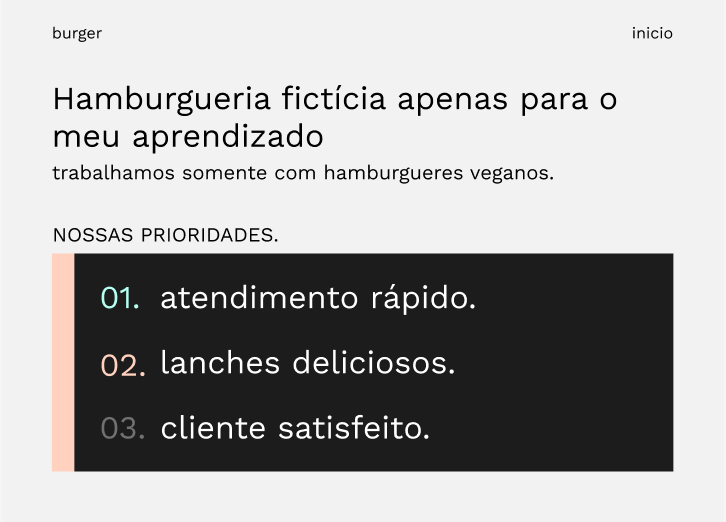

<h1 align="center">burgerFood.</h1>

🚀 Site fictício

OBS: neste projeto aprendi como selecionar tags de novas outras formas, a importar arquivos css que estejam em outra pasta, a utilizar classes, a utilizar atributos de acessibilidade e o básico de responsividade.

<h4>Status do projeto: Concluido.......</h4>

<h1>Link para acessar: https://gabriel-eustaquio.github.io/burgerFood/</h1>

<h1>🛠 Tecnologias:</h1>

HTML

CSS

Figma

<h1>Autor: </h1>

Gabriel Eustaquio

